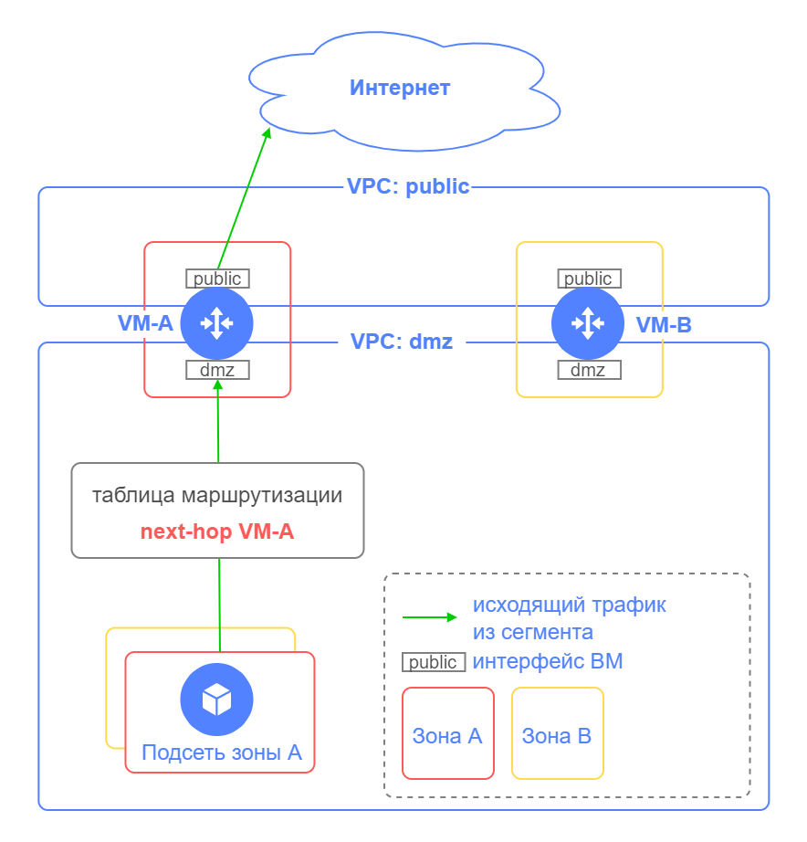
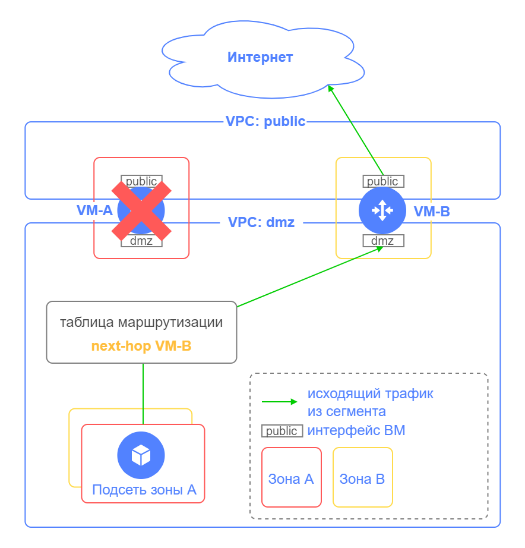
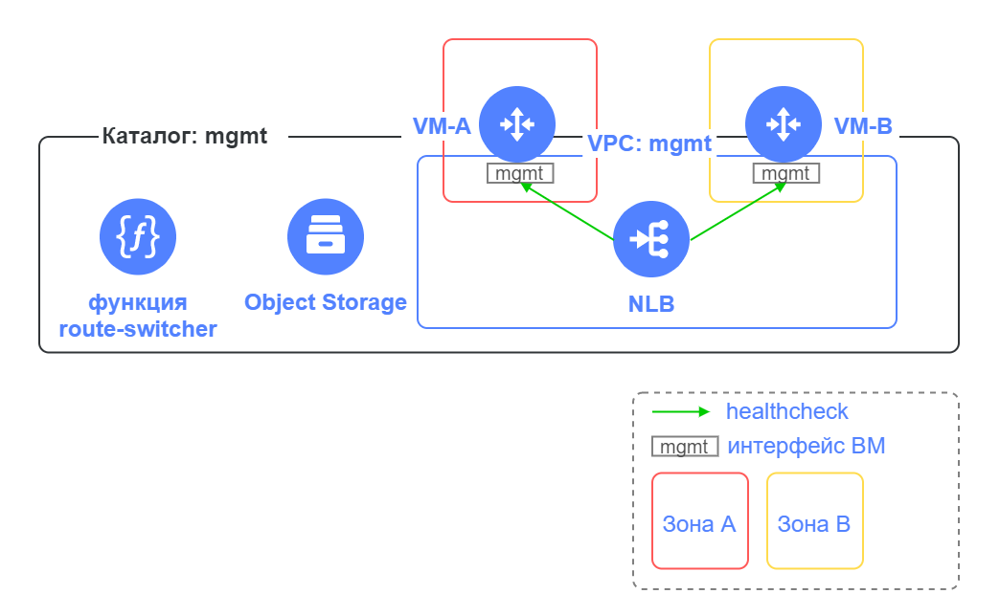
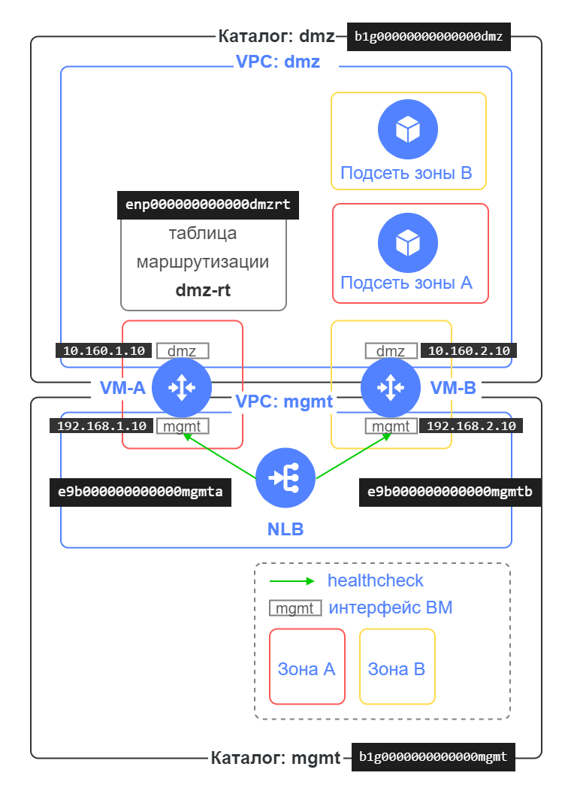

# Employing the `route-switcher` module to provide fault tolerance for VMs involved in firewalling, network security, and traffic routing 

## Contents

- [Introduction](#введение)
- [Module features](#возможности-модуля)
- [Module components](#компоненты-модуля)
- [Module input parameters](#входные-параметры-модуля)
- [Example of setting up the module input parameters](#пример-задания-входных-параметров-модуля)
- [Module output parameters](#выходные-параметры-модуля)
- [Preparing for deployment](#подготовка-к-развертыванию)
- [Arranging the deployment](#порядок-развертывания)
- [Testing fault tolerance](#проверка-отказоустойчивости)
- [Suspending the module](#остановка-работы-модуля)
- [Updating the module input parameters](#изменение-входных-параметров-модуля)
- [Changing routes in route tables](#изменение-маршрутов-в-таблицах-маршрутизации)
- [Use cases](#примеры-использования-модуля)

## Introduction

In Yandex Cloud, you can deploy a cloud infrastructure to protect your overall infrastructure, segmenting it into security zones using network VMs that provide firewalling, network security, and traffic routing functions.

Each network segment (hereinafter, simply _segment_) contains resources of a single purpose, isolated from other resources. Each segment in a cloud can have its own folder and a dedicated VPC cloud network. In such a scenario, those segments typically communicate through network VMs with multiple network interfaces hosted in each VPC.

To ensure high availability of deployed apps, such an infrastructure utilizes multiple network VMs deployed in different availability zones.

With [static routing](https://yandex.cloud/docs/vpc/concepts/static-routes), you can route traffic from subnets through network VMs.

The Yandex Cloud network does not support VRRP/HSRP protocols between network VMs.

Where a network VM fails, the `route-switcher` module switches outgoing traffic from the segment to a standby VM.

In the chart below, VM-A and VM-B run in `Active/Standby` mode for outgoing traffic from the segment.



If VM-A fails, the `route-switcher` module will switch the outgoing traffic to VM-B, so network connectivity (to the Internet and between segments) will be provided through the latter.



## Module features
- Switching next hop addresses in route tables to a standby VM when a network VM fails.  
- Re-switching next hop addresses in route tables back to the network VM after its recovery (configurable option).
- Average response time to failure: 1 min, or less (see [this](#алгоритм-работы-функции-route-switcher) for details).
- Utilizing network VMs with multiple network interfaces in different VPCs.
- Supporting multiple route tables in different VPCs.
- Supporting different network VMs as next hops, for different prefixes in the route table.
- Supporting multiple network VMs (two or more).
- Specifying TCP port for checking availability of network VMs.
- Logging the module operations with Cloud Logging.

## Module components

To run properly, the `route-switcher` module creates the following resources:
- Cloud function named `route-switcher`
- NLB 
- Bucket in Object Storage 



Comments to the chart:

| Element name | Description |
| ----------- | ----------- |
| Folder: `mgmt` | Folder to host `route-switcher` components. |
| VPC: mgmt | The VM network interfaces used to verify their availability will reside in subnets of that network. Typically, a segment of the control network is employed. |
| VM-A, VM-B | Network VMs for firewalling, network security, and traffic routing that you want to be fault-tolerant. |
| `route-switcher` function | Cloud function that checks network VM health. If a network VM is unavailable, the function switches the respective next hop addresses in route tables to a standby VM. Once a network VM recovers, the function re-switches next hop addresses in route tables back to that primary VM (you can customize this). | 
| NLB | Network load balancer for monitoring availability of network VMs. |
| Object Storage | Bucket in Object Storage to store the configuration file with the following information:<br>Route tables with preferred next hop addresses for prefixes.<br>Network VM IP addresses to check availability, as well as addresses for each network interface of a VM (the VM IP address and the respective IP address of its standby VM). |


### Algorithm of the `route-switcher` cloud function

The `route-switcher` function is triggered every minute (by default) to check the health (i.e., status) of each network VM. If a network VM is unavailable, this function switches the respective next-hop addresses in route tables. Once the network VM recovers, the function re-switches its next hop addresses back in route tables (if configured to do so).

You can reduce the interval between checking network VM health during the cloud function. To do this, configure `router_healthcheck_interval` in the module input parameters. The default value is 60s. If you change the default value, you may want to additionally test the fault tolerance use cases. We do not recommend to set the interval value to less than 10.


## Module input parameters

Before invoking the module, you must provide it with certain input parameters:

| Name | Description | Type | Default value | Required |
| ----------- | ----------- | ----------- | ----------- | ----------- |
| start_module | Enables or disables the module. This creates or removes a trigger that starts the `route-switcher` cloud function evey minute. Use `true` to enable and `false` to disable. | `bool` | `false` | Yes |
| folder_id | ID of the folder to host the `route-switcher` module components. | `string` | `null` | Yes |
| route_table_folder_list | List of IDs for all folders hosting route tables from `route_table_list`. | `list(string)` | `[]` | Yes |
| route_table_list | List of IDs for route tables in which next-hop address switching is required. | `list(string)` | `[]` | Yes |
| router_healthcheck_port | TCP port for checking the availability of network VMs. This port on the network VM will be unavailable for connection. |  `number` | `null` | Yes |
| back_to_primary | Enables or disables re-switching next-hop addresses in route tables back to the primary network VM after its recovery. Use `true` to enable and `false` to disable. | `bool` | `true` | No |
| routers | List of IP addresses for your network VMs. For each VM, specify:<br>`healthchecked_ip`: IP address to check the availability of the network VM.<br>`healthchecked_subnet_id`: Subnet for `healthchecked_ip`.<br>`interfaces`: List of IP addresses for network interfaces of that VM.<br>&nbsp;&nbsp;`own_ip`: IP address of the VM interface.<br>&nbsp;&nbsp;`backup_peer_ip`: IP address of the standby VM to reserve its `own_ip`. | <pre>list(object({<br> healthchecked_ip = string<br> healthchecked_subnet_id = string<br> interfaces = list(object({<br> own_ip = string<br> backup_peer_ip = string<br> }))<br> }))</pre> | `[]` | Yes |
| router_healthcheck_interval | Interval in seconds between checking network VM health while the `route-switcher` cloud function is running. We do not recommend setting it to values less than 10. If you change the default value, you may want to additionally test the fault tolerance scenarios.  | `number` | `60` | No |

## Example of setting up the module input parameters

Below, you can see a sample schema with folders, route tables, and network VM IP addresses.



<details>
<summary>Click to see the example of how you can set up the module input parameters with string values.</summary>

```yaml
module "route_switcher" {
  source    = "./modules/route-switcher/"
  start_module          = false
  folder_id = "b1g0000000000000mgmt" 
  route_table_folder_list = ["b1g00000000000000dmz"]
  route_table_list      = ["enp000000000000dmzrt"] 
  router_healthcheck_port = 22
  back_to_primary = true
  routers = [
    {
      healthchecked_ip = "192.168.1.10"
      healthchecked_subnet_id = "e9b000000000000mgmta"
      interfaces = [
        {
          own_ip = "10.160.1.10"
          backup_peer_ip = "10.160.2.10"
        }
      ]
    },
    {
      healthchecked_ip = "192.168.2.10"
      healthchecked_subnet_id = "e9b000000000000mgmtb"
      interfaces = [
        {
          own_ip = "10.160.2.10"
          backup_peer_ip = "10.160.1.10"
        }
      ]
    }
  ]
}
```

</details>

<details>
<summary>Click to see the example of how you can set up the module input parameters with Terraform resource objects.</summary>

If Terraform is used to deploy your network VMs, route tables, subnets, and folders, specify the respective Terraform resource objects in the module input parameters.

```yaml
module "route_switcher" {
  source    = "./modules/route-switcher/"
  start_module          = false
  folder_id = var.folder_id
  route_table_folder_list = [yandex_resourcemanager_folder.dmz.id]
  route_table_list      = [yandex_vpc_route_table.dmz-rt.id]
  router_healthcheck_port = 22
  back_to_primary = true
  routers = [
    {
      healthchecked_ip = yandex_compute_instance.router-a.network_interface.1.ip_address
      healthchecked_subnet_id = yandex_vpc_subnet.mgmt_subnet_a.id
      interfaces = [
        {
          own_ip = yandex_compute_instance.router-a.network_interface.0.ip_address
          backup_peer_ip = yandex_compute_instance.router-b.network_interface.0.ip_address
        }
      ]
    },
    {
      healthchecked_ip = yandex_compute_instance.router-b.network_interface.1.ip_address
      healthchecked_subnet_id = yandex_vpc_subnet.mgmt_subnet_b.id
      interfaces = [
        {
          own_ip = yandex_compute_instance.router-b.network_interface.0.ip_address
          backup_peer_ip = yandex_compute_instance.router-a.network_interface.0.ip_address
        }
      ]
    }
  ]
}
```

</details>

## Module output parameters

| Name | Description |
| ----------- | ----------- |
| route-switcher_nlb | Name of the network load balancer for monitoring availability of network VMs, in the `folder_id` folder. |
| route-switcher_bucket | Name of the Object Storage bucket, in the `folder_id` folder, to store the configuration file with the following information:<br>Route tables with preferred next-hop addresses for prefixes.<br>Network VM IP addresses to check availability, as well as addresses for each network interface of a VM (the VM IP address and the respective IP address of its standby VM). |
| route-switcher_function | Name of the cloud function, in the `folder_id` folder, that provides the `route-switcher` module operation to ensure fault tolerance for outgoing traffic from segments. |

## Preparing for deployment

1. Before deploying the solution in Yandex Cloud, make sure the following objects exist:
    - `folder_id` folder to host `route-switcher` components.
    - Route tables that require next-hop address switching.
    - All folders hosting route tables from `route_table_list`.
    - Network VMs that are pre-configured, up and running, and functional. 

2. Network VM [health checks](https://yandex.cloud/docs/network-load-balancer/concepts/health-check) will run from IP addresses belonging to the `198.18.235.0/24` and `198.18.248.0/24` ranges. Traffic filtering rules configured for your network VMs must support incoming traffic from addresses in those ranges. Otherwise, the network load balancer will not be able to check them; as a result, the targets (VMs) will not be assigned the `Healthy` status, impeding `route-switcher` operation. You can bind a security group to targets with the following rule for incoming traffic:

    - Port range: `router_healthcheck_port` (as specified in `route-switcher` input parameters).
    - Protocol: `TCP`.
    - Source: `Load balancer health checks`.
	
The same address range and TCP port must be configured in the allowing rule for incoming traffic, part of access policies in the network VMs (e.g., firewall access policy).

3. The module writes [function logs](https://yandex.cloud/docs/functions/operations/function/function-logs) to the default Cloud Logging group in the `folder_id` folder. The default log retention period is three days. You can [change the log retention period](https://yandex.cloud/docs/logging/operations/retention-period) in the Cloud Logging group.

## Arranging the deployment

> **Important:**
> 
> When deploying the solution, the `route-switcher` module must have its `start_module` input parameter set to `false` (default value).

1. Initialize Terraform:

    ```bash
    terraform init
    ```

2. Check that your Terraform files are properly configured:

    ```bash
    terraform validate
    ```

3. Check the list of cloud resources you are about to create:

    ```bash
    terraform plan
    ```

4. Create resources:

    ```bash
    terraform apply
    ```

5. After resources are deployed, make sure that checking the health of your network VMs returns `Healthy`. To do this, go to the Yandex Cloud console, navigate to the `folder_id` folder, select `Network Load Balancer`, and go to the `route-switcher-lb-...` network load balancer page. Expand the target group and make sure the targets are `Healthy`. If they are `Unhealthy`, verify that your network VMs are up and running, and that their traffic filtering rules are correct (see [Preparing for deployment](#подготовка-к-развертыванию), step 2).

6. After you verified that checking the health of your network VMs returns `Healthy`, switch the `start_module` input parameter of the `route-switcher` module to `true` to enable the module operation, and run these commands:

    ```bash
    terraform plan
    terraform apply
    ```
	
7. After running `terraform apply` with the `start_module = true` parameter, you will get the `route-switcher-trigger-...` trigger in the `folder_id` folder. This trigger will start the `route-switcher` cloud function every minute. The trigger is initiated within five minutes after it is created.

Once all deployment steps are completed, the segments will switch outgoing traffic to a standby VM if a network VM fails.

## Testing fault tolerance

> **Important:**
> 
> To test fault tolerance, you will need to stop a network VM, resulting in temporary network unavailability during the switchover process. In a production environment, you will need to agree upon a testing window in advance.

1. Select or create a Linux VM on the segment for which `route-switcher` provides outgoing traffic fault tolerance. In the Yandex Cloud console, change the settings for that VM by adding **Grant access to serial console**. Connect to the VM serial console and get authenticated.

2. In that VM, run outgoing traffic from the segment using `ping` to a resource on the Internet or in another segment.
    
3. In the Yandex Cloud console, select the network VM through which your outgoing traffic from the segment runs. Stop that VM to emulate its failure.

4. Monitor the loss of `ping` packets. After a network VM fails, there may be a traffic loss, with subsequent traffic recovery.

5. In the segment folder, check that the route table now uses the standby VM address as its next hop.

6. In the Yandex Cloud console, start the network VM you stopped earlier to emulate its recovery. 

7. If you specified the `back_to_primary = true` parameter in `route-switcher` settings, the network VM recovery will make the outgoing traffic switch back to that primary VM. You may see a traffic loss, with subsequent traffic recovery. In the segment folder, check that the route table now uses the address of the network VM from step 3 as its next hop.

8. In the Yandex Cloud console, disable **Grant access to serial console** for the Linux VM you run the `ping` command from.

## Suspending the module

To suspend `route-switcher`, switch its `start_module` input parameter to `false` to disable its operation, and then run these commands:

```bash
terraform plan
terraform apply
```

After running them, the `route-switcher-trigger-...` trigger that started the `route-switcher` cloud function every minute will be removed, and the module will stop. 

To start it back, complete steps 5 and 6 in [Arranging the deployment](#порядок-развертывания).

## Updating the module input parameters

You can update the `route-switcher` input parameters while the module is working. For example, in the input parameters, you can add or remove IP addresses for network VMs or route tables.

> **Important:**
> 
> Do not update any module input parameters unless your network VMs are up and running. Make sure that checking your network VMs returns `Healthy` (see [Arranging the deployment](#порядок-развертывания), step 5). 
> When adding route tables, `route-switcher` will store the current next-hop addresses of the route tables as preferred addresses in a configuration file in the Object Storage bucket.

To update the `route-switcher` input parameters, follow these steps:

1. Set up the module input parameters.

2. Run the following commands:
    ```bash
    terraform plan
    terraform apply
    ```

## Changing routes in route tables

While `route-switcher` is running, you can change the next-hop addresses for network VMs in the route tables specified in the module input parameters. To do this, follow these steps:

1. [Suspend `route-switcher`](#остановка-работы-модуля).

2. Make the required changes to the next-hop addresses in route tables.

3. Start `route-switcher` back, as per steps 5 and 6 in [Arranging the deployment](#порядок-развертывания).

## Use cases

Here are two examples of how to use the `route-switcher` module:

1. [Deploying a secure high-availability network infrastructure with a dedicated DMZ based on the next-generation firewall](https://github.com/yandex-cloud-examples/yc-dmz-with-high-available-ngfw/)

2. [Ensuring fault tolerance for a NAT instance](examples/README.md)
